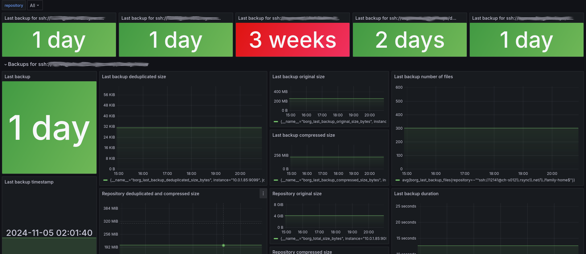

# Borg exporter

Borg exporter exposes borg metrics to be scraped by Prometheus.

## Metrics

The following metrics are exposed :

| Name                                     | Description                                      | Type    |
|------------------------------------------|--------------------------------------------------|---------|
| borg_last_backup_duration_seconds        | Duration of the last backup in seconds           | Gauge   |
| borg_last_backup_compressed_size_bytes   | Compressed size of the last backup in bytes      | Gauge   |
| borg_last_backup_deduplicated_size_bytes | Deduplicated size of the last backup in bytes    | Gauge   |
| borg_last_backup_files                   | Number of files in the last backup               | Gauge   |
| borg_last_backup_original_size_bytes     | Original size of the last backup in bytes        | Gauge   |
| borg_last_backup_timestamp               | Timestamp of the last backup (unix epoch*)       | Gauge   |
| borg_total_chunks                        | Repository total chunks                          | Gauge   |
| borg_total_compressed_size_bytes         | Repository total compressed size                 | Gauge   |
| borg_total_size_bytes                    | Repository total size                            | Gauge   |
| borg_total_unique_chunks                 | Repository total unique chunks                   | Gauge   |
| borg_deduplicated_compressed_size_bytes  | Repository deduplicated compressed size          | Gauge   |
| borg_deduplicated_size_bytes             | Repository deduplicated size                     | Gauge   |
| borg_collect_errors                      | Number of errors encountered by borg exporter    | Counter |
| borg_last_collect_error                  | 1 if the last collection failed, 0 if successful | Gauge   |
| borg_last_collect_duration_seconds       | Duration of the last metrics collection          | Gauge   |
| borg_last_collect_timestamp              | Timestamp of the last metrics collection         | Gauge   |
| borg_last_archive_info                   | Information about the last backup archive        | Gauge   |
| borg_repository_info                     | Information about the backup repository          | Gauge   |
| borg_system_info                         | Information about the borg backup system         | Gauge   |

\* number of seconds that have elapsed since January 1, 1970

Each of these metrics are in reality "labeled" metrics, such as `GaugeVec` and `CounterVec`, grouped (or labeled) by
`repository`.  
When using multiple repositories, each of these will be exposed for each repository.

## Configuration

The following environment variables can be used to configure the exporter :

| Name                     | Description                                                                                            | Required | Default    |
|--------------------------|--------------------------------------------------------------------------------------------------------|----------|------------|
| LISTEN_ADDRESS           | Address on which the server is to listen for connections                                               |          | `:9099`    |
| METRICS_PATH             | Path on which the server exposes the metrics                                                           |          | `/metrics` |
| METRICS_REFRESH_INTERVAL | Defines the frequency (interval of time) at which the exporter refreshes the metrics                   |          | `4h`       |
| SCHEDULER_CHECK_INTERVAL | Defines the frequency (interval of time) at which the scheduler checks if metrics need to be refreshed |          | `20s`      |
| COMMAND_TIMEOUT          | Timeout for borg commands                                                                              |          | `120s`     |
| BORG_REPOSITORIES        | Comma-separated list of borg repositories to expose metrics for                                        | `yes`    | ``         |
| BORG_PATH                | Path to the borg binary                                                                                |          | `borg`     |
| LOG_LEVEL                | Logging level (debug, info, warn, error)                                                               |          | `info`     |

We decided to decouple the metrics collection from the Prometheus `scrape_interval`, as collecting metrics can take some
time,
especially when using multiple repositories.  
That way, when Prometheus scrapes, we don't need to compute anything, just offer the latest "cached" metrics.

The `METRICS_REFRESH_INTERVAL` is by default set to a value of `12h`, but you can tweak it depending on your
requirement, for instance depending on the frequency of your backups.  
This value is optimized for daily backups, for which metrics won't change frequently.  
To try to run it at that interval even if the computer sleeps/wakes up, the internal scheduler will regularly check if
it's time to
refresh.  
By default, this happens every 20 seconds, but you can tweak it with `SCHEDULER_CHECK_INTERVAL`.

When using multiple repositories in `BORG_REPOSITORIES`, the exporter will not crash if it cannot retrieve metrics for
one of them, but instead an error will be logged.  
This is to allow collecting metrics for the other repositories.

## Installation

You can install it by downloading the latest version and placing it in `/usr/local/bin/borg-exporter`.  
Depending on your OS, you can then create a service to run it.  
For instance, using systemd, you can create `/etc/systemd/system/borg-exporter.service` :

```
[Unit]
Description=Borg Prometheus Exporter
After=network.target

[Service]
Type=simple
ExecStart=/usr/local/bin/borg-exporter
Environment="BORG_REPOSITORIES=ssh://my-repository/backups/my-machine,ssh://my-other-repository/backups/my-machine"
Restart=always
RestartSec=10

[Install]
WantedBy=multi-user.target
```

Then reload the systemd-daemon :

`sudo systemctl daemon-reload`

Then enable and start the service :

```
sudo systemctl enable borg-exporter.service
sudo systemctl start borg-exporter.service
```

You can check the logs with :

`sudo journalctl -fu borg-exporter`

If everything is correctly started, you should be able to check the metrics (after the initial collection which can
take a few minutes) :

`curl 127.0.0.1:9099/metrics`

### User considerations

The exporter should run with a user having access to the borg repositories, typically the user executing the
borg backups.

### Prometheus

To scrape the metrics from Prometheus, you can add a scrape configuration, for instance :

```
- job_name: 'borg'
  scrape_interval: 3m
  scrape_timeout: 30s
  static_configs:
    - targets:
      - '<hostname>:9099'
```

We set the `scrape_interval` to `3m`, as the exporter will by default only refresh them every 12 hours,
but you can tweak this value depending on your requirements.  
The advice is to keep it under `5m`, after which metrics are considered staled by Prometheus.

### Grafana dashboard

You can import the dashboard(s) from [the dashboards directory](./dashboards) in Grafana.  
The dashboard shows a top row with the age of the most recent backup for each repository, under which you can
see details for each repository.



## Release

The application follows semantic versioning.  
You can execute a release with :

`make release`

which will, by default, create a new `minor` version tag and push it.  
The release pipeline will thus be triggered.

You can release a new patch or major version with :

`./release.sh <major|minor|patch>`

You can dry-run the result (showing the tag that would be created) with the `--dry-run` flag.
