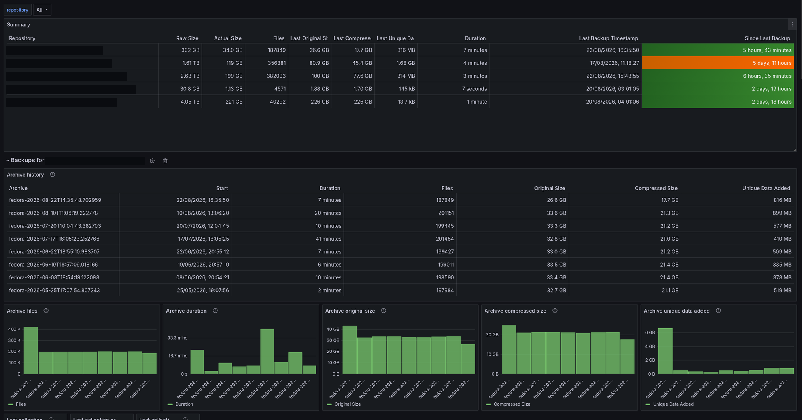

# backup-exporter

backup-exporter exposes [Borg](https://borgbackup.readthedocs.io/) and [restic](https://restic.net/) backup
metrics to be scraped by Prometheus.  
It parses the result of `borg info` and `restic snapshots`/`restic stats` for the repositories listed in its
config file.

## Metrics

### Borg

| Name                                       | Description                                      | Type  |
|---------------------------------------------|---------------------------------------------------|-------|
| `borg_last_backup_duration_seconds`        | Duration of the last backup in seconds           | Gauge |
| `borg_last_backup_compressed_size_bytes`   | Compressed size of the last backup in bytes      | Gauge |
| `borg_last_backup_deduplicated_size_bytes` | Deduplicated size of the last backup in bytes**  | Gauge |
| `borg_last_backup_files`                   | Number of files in the last backup               | Gauge |
| `borg_last_backup_original_size_bytes`     | Original size of the last backup in bytes        | Gauge |
| `borg_last_backup_timestamp`               | Timestamp of the last backup (unix epoch*)       | Gauge |
| `borg_archive_duration_seconds`            | Duration of the archive's backup in seconds      | Gauge |
| `borg_archive_compressed_size_bytes`       | Compressed size of the archive in bytes          | Gauge |
| `borg_archive_deduplicated_size_bytes`     | Deduplicated size of the archive in bytes**      | Gauge |
| `borg_archive_files`                       | Number of files in the archive                   | Gauge |
| `borg_archive_original_size_bytes`         | Original size of the archive in bytes            | Gauge |
| `borg_archive_timestamp`                   | Timestamp of the archive's backup (unix epoch*)  | Gauge |
| `borg_total_chunks`                        | Repository total chunks                          | Gauge |
| `borg_total_compressed_size_bytes`         | Repository total compressed size                 | Gauge |
| `borg_total_size_bytes`                    | Repository total size                            | Gauge |
| `borg_total_unique_chunks`                 | Repository total unique chunks                   | Gauge |
| `borg_deduplicated_compressed_size_bytes`  | Repository deduplicated compressed size          | Gauge |
| `borg_deduplicated_size_bytes`             | Repository deduplicated size                     | Gauge |
| `borg_last_archive_info`                   | Information about the last backup archive        | Gauge |
| `borg_repository_info`                     | Information about the backup repository          | Gauge |

\* number of seconds that have elapsed since January 1, 1970  
\*\* this is *not* "the size of this backup after deduplication". Borg computes it as the data
that is exclusively owned by this one archive relative to the repository's current state (i.e.
what would be freed if you deleted just this archive) — it is order-dependent and can read `0`
for a large, valid backup if its content duplicates another archive already in the repository, and
can change for an older archive once newer archives are created. See the
[borg documentation](https://borgbackup.readthedocs.io/en/stable/usage/info.html) for details.

Each of these metrics is labeled by `repository`. The `borg_archive_*` metrics are additionally labeled by
`archive` (the archive name), and are exposed for the last `N` archives of each repository, `N` being
configurable via `ARCHIVE_HISTORY_LIMIT` (default 10) — see [Configuration](#configuration). This includes
archives that predate the exporter tracking a repository, unlike the `borg_last_backup_*` metrics which only
reflect what Prometheus has scraped over time.

### Restic

| Name                                          | Description                                                             | Type  |
|------------------------------------------------|----------------------------------------------------------------------------|-------|
| `restic_last_backup_duration_seconds`         | Duration of the last backup in seconds***                              | Gauge |
| `restic_last_backup_original_size_bytes`      | Original (restore) size of the last backup in bytes                    | Gauge |
| `restic_last_backup_files`                    | Number of files in the last backup                                     | Gauge |
| `restic_last_backup_timestamp`                | Timestamp of the last backup (unix epoch*)                             | Gauge |
| `restic_last_backup_data_added_bytes`         | Uncompressed data added to the repository by the last backup***        | Gauge |
| `restic_last_backup_data_added_packed_bytes`  | Compressed data added to the repository by the last backup***          | Gauge |
| `restic_archive_duration_seconds`             | Duration of the snapshot's backup in seconds***                        | Gauge |
| `restic_archive_original_size_bytes`          | Original (restore) size of the snapshot in bytes                       | Gauge |
| `restic_archive_files`                        | Number of files in the snapshot                                        | Gauge |
| `restic_archive_timestamp`                    | Timestamp of the snapshot's backup (unix epoch*)                       | Gauge |
| `restic_archive_data_added_bytes`             | Uncompressed data added to the repository by this snapshot***          | Gauge |
| `restic_archive_data_added_packed_bytes`      | Compressed data added to the repository by this snapshot***            | Gauge |
| `restic_last_snapshot_info`                   | Information about the last backup snapshot                             | Gauge |

\* number of seconds that have elapsed since January 1, 1970  
\*\*\* restic only records this data (its snapshot "summary" block) from a version recent enough to capture
it. Snapshots taken by an older restic — including ones that already existed before you upgraded — simply
won't have these series; the exporter doesn't fake a `0`, it leaves them unset.

Each of these metrics is labeled by `repository`. The `restic_archive_*` metrics are additionally labeled by
`snapshot` (the short snapshot ID), and are exposed for the last `N` snapshots of each repository, `N` being
shared with Borg's `ARCHIVE_HISTORY_LIMIT`.

There's no restic equivalent of Borg's chunk-level dedup stats (`borg_total_chunks` and friends) or repository
info — restic's CLI doesn't expose them per-repository, so those are simply not present for restic rather than
faked with an approximation.

`restic_*_original_size_bytes`/`files` come from `restic stats <snapshot> --mode restore-size`, which is a
separate, comparatively slow command per snapshot (especially over a WAN/SFTP backend). To keep collection
cheap, the exporter caches these per snapshot across cycles and only recomputes them for snapshots it hasn't
seen before, plus the latest snapshot every cycle (older snapshots' sizes don't change). It self-heals this
cache against `forget`/`prune` on the repository — a snapshot ID that disappears from `restic snapshots` is
dropped from the cache too.

### Exporter (shared across tools)

| Name                                       | Description                                          | Type    |
|---------------------------------------------|---------------------------------------------------------|---------|
| `exporter_collect_errors`                  | Number of errors encountered while collecting metrics | Counter |
| `exporter_last_collect_error`              | 1 if the last collection failed, 0 if successful      | Gauge   |
| `exporter_last_collect_duration_seconds`   | Duration of the last metrics collection                | Gauge   |
| `exporter_last_collect_timestamp`          | Timestamp of the last metrics collection                | Gauge   |
| `exporter_system_info`                     | Information about a configured backup tool              | Gauge   |

These describe the exporter's own operation rather than backup domain data, so they're shared across every
configured tool instead of duplicated per tool. They're labeled by `tool` (`borg` or `restic`) and
`repository`, except `exporter_system_info` which is labeled by `tool`, `hostname` and `version`.

## Configuration

### Repositories: YAML config file

The list of repositories to collect metrics for is defined in a YAML file, passed via `-config` or
`CONFIG_FILE`. It supports a mix of `borg` and `restic` entries:

```yaml
repositories:
  - name: home            # used as the "repository" label on every metric
    type: borg
    path: ssh://my-repository/backups/my-machine
    opts: "--lock-wait 5" # optional, extra borg options

  - name: photos
    type: restic
    repository: sftp:user@host:/path/to/repo
    # exactly one of the following three is required:
    password_command: "pass show restic/photos"  # recommended
    # password_file: /run/secrets/restic-photos-password
    # password: "not recommended, ends up readable in the config file"
```

`password` mirrors restic's own `RESTIC_PASSWORD` convention and is supported for compatibility with existing
restic setups, but is discouraged — the exporter logs a warning on startup for any restic repository using it.

### Exporter settings: flags or environment variables

Everything else is configured by flags or environment variables:

| Environment variable       | Flag                        | Description                                                                                            | Required | Default    |
|-----------------------------|-------------------------------|-------------------------------------------------------------------------------------------------------|----------|------------|
| `CONFIG_FILE`               | `-config`                    | Path to the YAML repositories config file (see above)                                                 | `yes`    | ``         |
| `LISTEN_ADDRESS`            | `-listen-address`            | Address on which the server is to listen for connections                                              |          | `:9099`    |
| `METRICS_PATH`              | `-metrics-path`               | Path on which the server exposes the metrics                                                          |          | `/metrics` |
| `BORG_REFRESH_INTERVAL`     | `-borg-refresh-interval`      | Frequency at which borg metrics are refreshed                                                          |          | `4h`       |
| `RESTIC_REFRESH_INTERVAL`   | `-restic-refresh-interval`    | Frequency at which restic metrics are refreshed                                                        |          | `4h`       |
| `SCHEDULER_CHECK_INTERVAL`  | `-scheduler-check-interval`   | Frequency at which each scheduler checks if its metrics need to be refreshed                          |          | `20s`      |
| `COMMAND_TIMEOUT`           | `-command-timeout`            | Timeout for a full collection cycle (all repositories of one tool)                                    |          | `120s`     |
| `BORG_PATH`                 | `-borg-path`                  | Path to the borg binary                                                                                |          | `borg`     |
| `RESTIC_PATH`                | `-restic-path`                | Path to the restic binary                                                                              |          | `restic`   |
| `LOG_LEVEL`                  | `-log-level`                  | Logging level (debug, info, warn, error)                                                                |          | `info`     |
| `ARCHIVE_HISTORY_LIMIT`      | `-archive-history-limit`      | Number of most recent archives/snapshots to expose `*_archive_*` per-item metrics for, shared by both tools |    | `10`       |

Borg and restic are collected by two independent schedulers, each on its own refresh interval — a slow/WAN
restic collection won't delay Borg's (or vice versa). If a config file has only one of the two repository
types, only that tool's scheduler runs.

We decided to decouple metrics collection from the Prometheus `scrape_interval`, as collecting metrics can
take some time, especially over multiple repositories or a slow backend.  
That way, when Prometheus scrapes, we don't need to compute anything, just offer the latest "cached" metrics.

The refresh intervals default to `4h`, but you can tweak them depending on your requirements, for instance
depending on the frequency of your backups. This value is optimized for daily backups, for which metrics
won't change frequently.  
To try to run at that interval even if the computer sleeps/wakes up, the internal scheduler will regularly
check if it's time to refresh. By default, this happens every 20 seconds, but you can tweak it with
`SCHEDULER_CHECK_INTERVAL`.

When a tool has multiple repositories configured, the exporter will not crash if it cannot retrieve metrics
for one of them, but instead an error will be logged.  
This is useful to already expose the metrics that it was able to gather.  
In case of errors, if that tool's refresh interval is greater than 5 minutes, it will retry 5 times, waiting
one minute between each try, before stopping and waiting for the next refresh.  
This is to avoid potentially waiting for hours in case of a transient error.

### Migrating from borg-exporter

This project was renamed from `borg-exporter` to `backup-exporter`, and its configuration was reworked from
flags/env-only to the YAML file above, as part of adding restic support. There's no compatibility shim — this
is a one-time breaking change:

- Replace `BORG_REPOSITORIES`/`-borg-repositories` (comma-separated paths) and `BORG_OPTS`/`-borg-opts` with a
  `repositories:` YAML file, one `type: borg` entry per repository, `opts:` set per-entry if needed.
- `METRICS_REFRESH_INTERVAL`/`-metrics-refresh-interval` is now `BORG_REFRESH_INTERVAL`/`-borg-refresh-interval`.
- The binary and systemd unit/service name changed from `borg-exporter` to `backup-exporter`.
- `borg_collect_errors`, `borg_last_collect_error`, `borg_last_collect_duration_seconds`,
  `borg_last_collect_timestamp` and `borg_system_info` were replaced by the shared `exporter_*` metrics above
  (now labeled by `tool` too) — update any alerts/dashboards referencing the old names.

## Installation

You can install it by downloading the latest version and placing it in `/usr/local/bin/backup-exporter`.  
Depending on your OS, you can then create a service to run it.  
For instance, using systemd, you can create `/etc/systemd/system/backup-exporter.service` :

```
[Unit]
Description=Backup Prometheus Exporter
After=network.target

[Service]
Type=simple
ExecStart=/usr/local/bin/backup-exporter
Environment="CONFIG_FILE=/etc/backup-exporter/config.yaml"
Restart=always
RestartSec=10

[Install]
WantedBy=multi-user.target
```

Then reload the systemd-daemon :

`sudo systemctl daemon-reload`

Then enable and start the service :

```
sudo systemctl enable backup-exporter.service
sudo systemctl start backup-exporter.service
```

You can check the logs with :

`sudo journalctl -fu backup-exporter`

If everything is correctly started, you should be able to check the metrics (after the initial collection which can
take a few minutes) :

`curl 127.0.0.1:9099/metrics`

### User considerations

The exporter should run with a user having access to the borg/restic repositories, typically the user
executing the backups. For restic repositories using `password_command`, the command must be runnable
(and succeed non-interactively) as that same user.

### Prometheus

To scrape the metrics from Prometheus, you can add a scrape configuration, for instance :

```
- job_name: 'backup-exporter'
  scrape_interval: 3m
  scrape_timeout: 30s
  static_configs:
    - targets:
      - '<hostname>:9099'
```

We set the `scrape_interval` to `3m`, as the exporter will by default only refresh them every 4 hours,
but you can tweak this value depending on your requirements.  
The advice is to keep it under `5m`, after which metrics are considered staled by Prometheus.

### Grafana dashboard

You can import the dashboard(s) from [the dashboards directory](./dashboards) in Grafana.  
The dashboard shows a summary table across all repositories, under which you can see details for each
repository: an archive history table and size/files/duration bar charts for the last `N` archives (see
`ARCHIVE_HISTORY_LIMIT`), and exporter collection health.

The current dashboard covers Borg repositories only — restic panels are tracked separately
([#11](https://github.com/lefeverd/backup-exporter/issues/11)).



## Release

The application follows semantic versioning.  
You can execute a release with :

`make release`

which will, by default, create a new `minor` version tag and push it.  
The release pipeline will thus be triggered.

You can release a new patch or major version with :

`./release.sh <major|minor|patch>`

You can dry-run the result (showing the tag that would be created) with the `--dry-run` flag.
